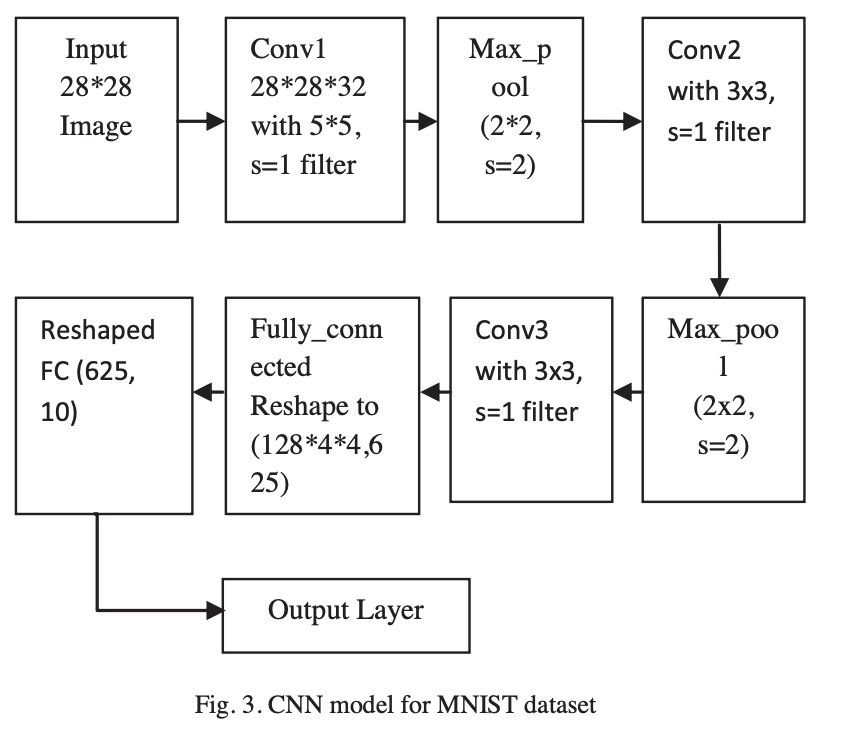

# Handwritten Digit Recognition using Custom CNN

A complete, modular PyTorch implementation of a Convolutional Neural Network (CNN) for handwritten digit recognition, trained and evaluated on the classic MNIST dataset.

This project demonstrates a solid understanding of deep learning pipelines, including data preprocessing, custom model architecture, optimization (RMSprop), and real-world inference with custom user-drawn images.

## Model Architecture

The model uses a VGG-style CNN. The `CNN_Model.png` diagram is the high-level flow:

`Input (28x28)` -> `Conv1 (32, 5x5)` -> `MaxPool` -> `Conv2 (64, 3x3)` -> `MaxPool` -> `Conv3 (128, 3x3)` -> `Fully Connected` -> `Output (10 classes)`



**Implementation note**: the actual code in `src/model.py` includes a `MaxPool2d` after `Conv3` and an `AdaptiveAvgPool2d(4, 4)` before flattening, so the feature vector is always `128 x 4 x 4 = 2048` before `FC1`.

Detailed architecture (implemented in code):

| Layer | Type | Configuration | Output Shape | Parameters |
| :--- | :--- | :--- | :--- | :--- |
| **Input** | Image | Grayscale, 28x28 | `[B, 1, 28, 28]` | - |
| **Block 1** | Conv2D + ReLU | 32 filters, 5x5 kernel, stride 1, padding 2 | `[B, 32, 28, 28]` | Weight + Bias |
|  | MaxPool2D | 2x2 kernel, stride 2 | `[B, 32, 14, 14]` | - |
|  | Dropout | p = 0.2 | `[B, 32, 14, 14]` | - |
| **Block 2** | Conv2D + ReLU | 64 filters, 3x3 kernel, stride 1, padding 0 | `[B, 64, 12, 12]` | Weight + Bias |
|  | MaxPool2D | 2x2 kernel, stride 2 | `[B, 64, 6, 6]` | - |
|  | Dropout | p = 0.2 | `[B, 64, 6, 6]` | - |
| **Block 3** | Conv2D + ReLU | 128 filters, 3x3 kernel, stride 1, padding 2 | `[B, 128, 8, 8]` | Weight + Bias |
|  | MaxPool2D | 2x2 kernel, stride 2 | `[B, 128, 4, 4]` | - |
| **Pooling** | AdaptiveAvgPool2D | Output size: 4x4 | `[B, 128, 4, 4]` | - |
| **Flatten** | Reshape | - | `[B, 2048]` | - |
| **FC 1** | Linear + ReLU | 2048 -> 625 | `[B, 625]` | Weight + Bias |
|  | Dropout | p = 0.2 | `[B, 625]` | - |
| **FC 2** | Linear | 625 -> 10 (Classes) | `[B, 10]` | Weight + Bias |

- **Optimizer:** RMSprop (Learning Rate = 0.001, `alpha` = 0.9)
- **Loss Function:** Cross-Entropy Loss
- **Hardware Acceleration:** Supports Apple Metal Performance Shaders (MPS) for macOS and CUDA for NVIDIA GPUs.

## Installation & Setup

Follow these instructions to set up the environment and run the project on your local machine.

### 1. Clone the Repository

```bash
git clone https://github.com/tienesng06/MNIST-using-CNN.git
cd MNIST-with-CNN---Resnet
```

### 2. Create a Virtual Environment (Recommended)

```bash
python -m venv myenv
source myenv/bin/activate  # On macOS/Linux
myenv\Scripts\activate   # On Windows
```

### 3. Install Dependencies

Ensure you have `requirements.txt` in your root directory.

```bash
pip install -r requirements.txt
```

## Usage

The project is modularized for readability and maintainability.

### 1. Training the Model

To train the model from scratch, open `src/train.py`, ensure the `train_model(...)` function is uncommented in the main block, and run:

```bash
python src/train.py
```

The model will automatically save its learned weights to `mnist_paper_cnn.pth` upon completion.

### 2. Evaluating the Model

To evaluate the pre-trained model on the 10,000 unseen test images:

```bash
python src/train.py
```

Make sure to comment out the training function and uncomment the `evaluate_model()` function in `src/train.py`.

Current accuracy: **> 99.0%**

### 3. Real-world Inference (Test with Your Own Handwriting)

Draw a digit (0-9) using any painting software (black text, white background, square aspect ratio preferred), save it in the project root, then update the filename in `src/custom_input.py` (default: `your_picture.png`) and run:

```bash
python src/custom_input.py
```

The script handles preprocessing steps (grayscale conversion, inversion to match MNIST distribution, resizing, normalization) and outputs the model prediction with a confidence score.
